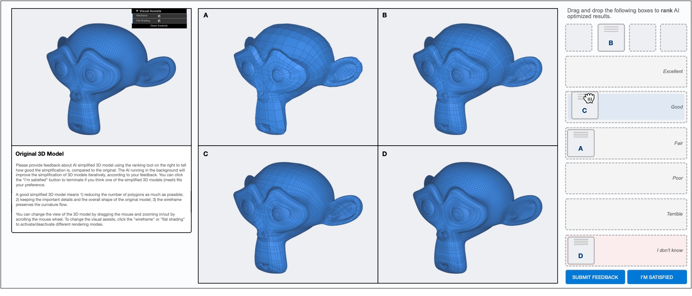

# Expertise in the Loop



**The Impact of Expertise in the Loop for Exploring Machine Rationality** <br/>
**[Changkun Ou](https://changkun.de)**, **[Sven Mayer](https://sven-mayer.com)**, and **[Andreas Butz](http://butz.org)** <br/>
In Proceedings of the 28th International Conference on Intelligent User Interfaces. ACM, March 27-31, 2023, Sydney, Australia. <br/>

This repository includes the collected dataset (anonymized), and the source code of scripts to reproduce the results reported in the paper.

## Dataset

TODO:

## Scripts and Figures

TODO:

## Contribute

The easiest way to contribute is to provide feedback! We would love to hear what you think. Please write to [research@changkun.de](mailto:research[at]changkun.de) for closer communication.

## Licenses and Citation

Copyright &copy; 2023. [LMU Munich Media Informatics Group](https://www.medien.ifi.lmu.de). All rights reserved.

The [dataset](./data) itself (i.e., metadata, generated files, generated optimizer configurations, etc), available in [Creative Commons Public Domain Dedication (CC-0)](https://creativecommons.org/share-your-work/public-domain/cc0/), represented the results from consented anonymous participants and was collected by [Changkun Ou](https://changkun.de). The contained "source code" (i.e., Go, Python, R, JavaScript, etc) of this work is made available under the terms of [GNU GPLv3](./LICENSE) (by default).

If you find our research is helpful, we would appreciate a citation via:

```bibtex
@inproceedings{ou2023expertise,
	title        = {The Impact of Expertise in the Loop for Exploring Machine Rationality},
	author       = {Ou, Changkun and Mayer, Sven and Butz, Andreas},
	year         = 2023,
	booktitle    = {Proceedings of the 28th International Conference on Intelligent User Interfaces},
	location     = {Sydney, Australia},
	publisher    = {Association for Computing Machinery},
	address      = {New York, NY, USA},
	series       = {IUI '23},
	numpages     = 15,
	keywords     = {human-in-the-loop machine learning, adaptive human-computer interaction, rationality},
}
```